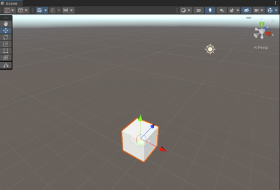
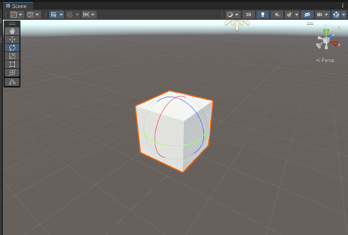
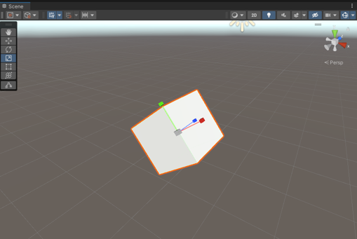
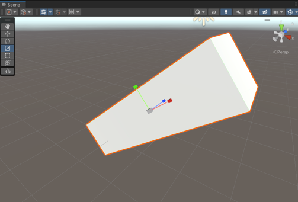

# ⌨️유니티의 유용한 단축키들⌨️

---
작성자 : 19 김성우

<pre>
유니티에는 편리한 기능들이 아주 많이 구현 되어있습니다. 모든 기능들에 대해서 단축키들을 모두 알고있다면 좋겠지만 현실적으로 불가능합니다.
여기에는 그중에서도 자주 사용하는 기능들의 단축키들을 작성해놨습니다. 이 단축키들을 숙지하고 있다면 개발 시간을 줄일 수 있을 것입니다.
</pre>

---

# 📝 유용한 단축키 목록

## 1. 저장 : cntl + S

> 저장을 생활화 합시다.

## 2. 오브젝트 이동 : (오브젝트를 선택한 상태에서) W

> 오브젝트의 position을 변경할 수 있습니다.
>   
>  

## 3. 오브젝트 회전 : (오브젝트를 선택한 상태에서) E

> 오브젝트의 rotation을 변경할 수 있습니다.  
>  

## 4. 오브젝트 크기조절 : (오브젝트를 선택한 상태에서) R

> 오브젝트의 scale을 변경할 수 있습니다.
>   
>  

## 5. 오브젝트 복제 : (오브젝트를 선택한 상태에서) cntl + D

> cntl + C , cntl + V와 동일하며 오브젝트를 복제하여 생성합니다. 복제된 오브젝트의 이름은 유니티에서 자동으로 넘버링해줍니다. 
>     
> 넘버링의 기본 값은 name(1),name(2)이며 기본값을 변경하고 싶다면 [Edit] - [Project Setting] - [Editor] -[Numbering Scheme]에서 [Game Object Naming]을 변경하면 됩니다.
>  

## 6. 좌표계 변경 : X

> 표시되는 좌표계를 변경해줍니다. 좌표계에 대한 자세한 내용은 좌표계 페이지를 확인바랍니다.
>  
---

# ⚠️ 주의사항

## 1. Rigidbody를 이용한 이동

>1. Rigidbody 컴포넌트를 가지는 오브젝트는 물리법칙을 받게된다. 이동 구현을 위해 오브젝트에 AddForce로 힘을 가하게되면 가속도, 관성등이 생기게 되므로 플레이어가 방향전환을 할 때 즉각적인 방향전환이 어렵다.
>2. AddForce로 힘을 주는 방향은 월드 좌표계 기준 방향으로 힘을 주게된다.(자세한 내용은 좌표계 파트를 확인) 즉, 캐릭터가 바라보는 방향과 상관없이 언제나 같은 방향으로 이동하게 된다.

 

## 2. 벡터를 사용한 이동
>1. transform.Translate 함수의 기본 좌표계는 로컬 좌표계로 설정이 되어있다. 즉 플레이어가 바라보는 곳을 기준으로 상/하/좌/우로 움직이게 된다.

  

# 🤝 같이 보면 좋은 파트

[1. 월드 좌표계와 로컬 좌표계](https://github.com/starhome7/GG_Unity_GitHub/blob/main/3D%20Scripts/1.%20Player%20%EC%9D%B4%EB%8F%99%20%EA%B5%AC%ED%98%84%ED%95%98%EA%B8%B0/1.%20Player%20%EC%9D%B4%EB%8F%99%20%EA%B5%AC%ED%98%84%ED%95%98%EA%B8%B0.md)

[2. Rigidbody란?](https://github.com/starhome7/GG_Unity_GitHub/blob/main/3D%20Scripts/1.%20Player%20%EC%9D%B4%EB%8F%99%20%EA%B5%AC%ED%98%84%ED%95%98%EA%B8%B0/1.%20Player%20%EC%9D%B4%EB%8F%99%20%EA%B5%AC%ED%98%84%ED%95%98%EA%B8%B0.md)

