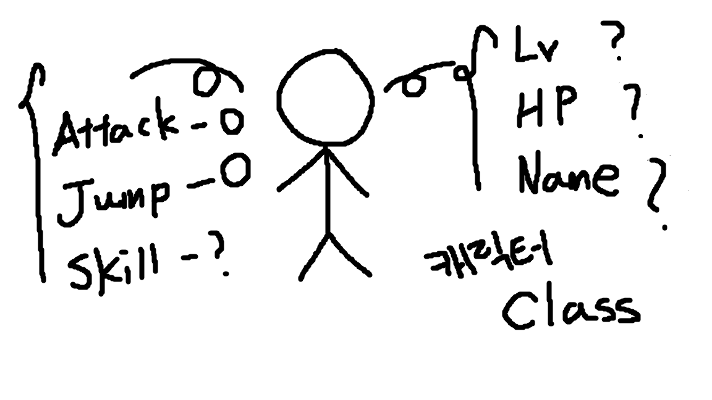
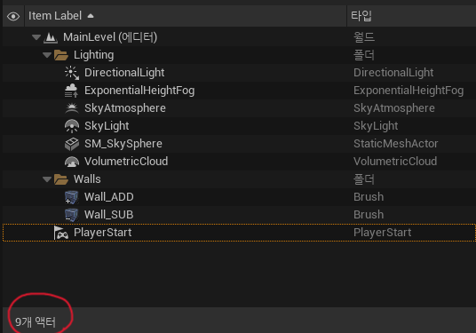
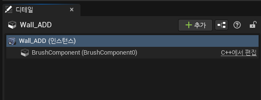
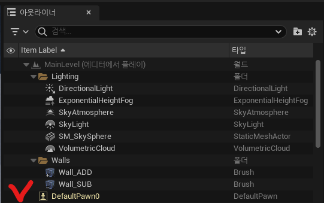

# :raccoon:시작해요 언리얼엔진🌳

---

# [4.오브젝트,액터 그리고 폰]
작성자 : 19 김성우

<pre>
이번 시간에는 언리얼 엔진에서 계속 마주치게 될 오브젝트, 액터 그리고 폰에 대해 설명해보겠습니다.
객체지향 프로그래밍의 개념까지 같이 설명할 계획인데 설명을 쉽게하기 위해 든 예시에는 약간의 비약이 있을 수 있으니 작성자가 말하고자하는 의도만 파악해주시면 감사하겠습니다.
</pre>

---
  
## 1.오브젝트
> 전공자인 여러분들에게 오브젝트라는 개념은 사실 생소한 개념이 아닙니다.(아마도?) 우리는 객체지향프로그래밍 수업 때 JAVA를 배우면서 객체지향이라는 개념을 배웠습니다.
> 여러분들이 자주쓰는 Python 그리고 언리얼에서 사용되는 C++에서도 객체지향 프로그래밍을 하는데 이때 사용되는 개념이 객체, 즉 Object입니다.
> 오브젝트라는 건 어떠한 구조가 정해져 있는 것은 아닙니다. 단지 우리가 만들고자 하는 무언가를 함수와 변수(data)들로 표현한 것을 의미합니다.
> 예를 들어, 게임에서 사용할 캐릭터 오브젝트를 하나 만든다고 가정해봅시다. 캐릭터는 레벨, HP, 이름등의 변수들이 내부적으로 필요할 것이고
> 공격, 점프, 스킬 등과 같은 동작들을 수행해 줄 함수들도 만들어야 할 것입니다. 이런 변수들과 함수들이 모여서 다음과 같이 하나의 '캐릭터'라는 오브젝트를 만들게 되는 것이죠.
>>  
> 여러분이 이렇게 캐릭터 하나를 만들고 나니 문제가 발생했습니다. 팀장이 캐릭터 1천개를 만들어오라고 하네요. 어떻게 해야할까요? 같은 방법으로 오브젝트를 일일이 1천번 만들어야할까요? 아님 1천번 복사?

## 2.클래스
>위와 같은 상황을 해결해 줄 수 있는 방법이 바로 클래스 입니다. 클래스는 우리가 만들고자하는 오브젝트의 틀을 의미합니다.
> 게임에서 사용할 '캐릭터' 오브젝트들이 가지는 공통적인 특징들을 묶어서 틀로 만든 후 캐릭터을 찍어내면 됩니다.
> 예를 들어, '캐릭터' 오브젝트들은 공통적으로 Level, HP, Name 변수를 가지고 있고 Attack, Jump, Skill 행동을 수행하는 함수를 필요로 합니다.
>>  
>   이렇게 틀을 잡아놓은 뒤 그 캐릭터가 마법사인지 전사인지에 따라 각자 다른 값만 넣어주면 하나의 클래스로 여러개의 오브젝트를 생성할 수 있게됩니다.
>>  
>>  

## 3.인스턴스
>> 인스턴스는 클래스로 부터 생성된 복제본을 의미합니다. 아까 우리가 만든 여러 캐릭터 오브젝트들이 모두 '캐릭터'클래스의 인스턴스가 되는 것이죠.
>> 오브젝트를 만들 때 메모리 상에 구현된 소프트웨어 상의 오브젝트라고 이해하면 됩니다. 오브젝트와 인스턴스는 엄밀히 물리적이냐 소프트웨어적이냐의 차이가 있고 다른 것이지만 흔히 오브젝트와 인스턴스는 혼용해서 사용됩니다. 

## 4.액터
>  지금까지는 객체지향 프로그래밍에 대한 내용이였습니다. 여기까지 잘 따라온 성우 학생은 자신감에 가득차 언리얼 엔진을 실행합니다. 그런데 이게 웬걸 아웃라이너에 오브젝트들이 아닌 액터들 밖에 없네요.
>  액터는 또 뭐고, 오브젝트들은 어디에 있는 걸까요?
> >  
>   액터는 우리가 지난 시간에 설치한 Wall_ADD나 Wall_SUB 처럼 레벨 상에 설치할 수 있는 오브젝트를 의미합니다. 그리고 우리가 위에서 이해했던 오브젝트의 개념들도 사실은 오브젝트 중에서도 액터에 속합니다.
> 우리가 오브젝트에 대한 정의를 설명할 때 만들고자 하는 무엇인가를 함수와 변수를 통해 표현한 것이라고 불렀습니다. 따라서 레벨에 직접 배치할 수는 없어도 변수와 함수들만으로 무언가 동작할 수 있으면 모두 오브젝트이고, 그 중에서도 특별히
> 레벨에 직접배치할 수 있는 것을 '액터'라고 합니다.

## 5.컴포넌트
> 실체가 없는 오브젝트들 중에서 액터에 추가할 수 있는 오브젝트들을 '컴포넌트'라고 합니다. 아마 유니티를 해보신 분들은 컴포넌트라는 개념에 익숙할 것입니다.
> 컴포넌트들은 그 자체만으로는 레벨에 존재할 수 없지만 액터에 추가됨으로서 해당 액터가 특정 동작을 할 수 있도록 합니다.
>>  
> >  우리가 지난 시간에 만든 Wall_ADD라는 액터입니다. 이 액터는 BrushComponent라는 이름의 Brush컴포넌트를 가지고 있네요. 아마 이 컴포넌트가 지오메트리를 더하고 빼주는 동작을 해주는 것 같습니다.

## 6.폰
> 게임을 만들고 테스트해보기 위해 플레이 버튼을 누르면 아웃라이너에 DefaultPawn이라는 액터가 추가 되는 것을 볼 수 있습니다.
>>  
>   체스를 둘 줄 아시는 분은 폰 액터의 아이콘이 체스의 그것과 똑같다는 것을 알 수 있을 텐데요. 언리얼 엔진에서의 '폰'은 체스의 말 처럼 게임에서의 말, 쉽게말하면 캐릭터들을 의미합니다.
> '폰'은 액터의 서브 클래스로 게임 내 아바타 또는 페르소나 역할을 하며 이러한 '폰'들에 플레이어 또는 AI가 빙의되어 움직이게 됩니다.

> ※ '캐릭터'라는 '폰'의 서브클래스가 존재하고 'Player Controller'와 'AI Controller'등이 있지만 이 친구들은 다음에 다시 만났을 때 설명하도록 하겠습니다.

---
## 다음 시간에 할 내용
> 오늘은 본격적인 게임 제작에 앞서서 언리얼 엔진에서 계속 보게 될 오브젝트,액터 그리고 폰에 대해 알아보았습니다.
> 다음 시간 부터는 간단한 슈팅 게임을 만들면서 블루프린트와 언리얼 엔진의 다양한 기능들을 알아보는 시간을 가지도록 하겠습니다.

