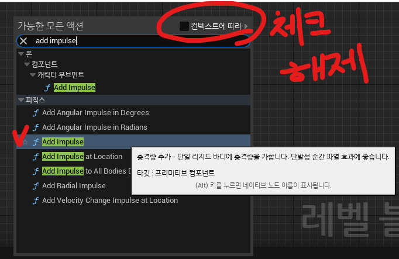
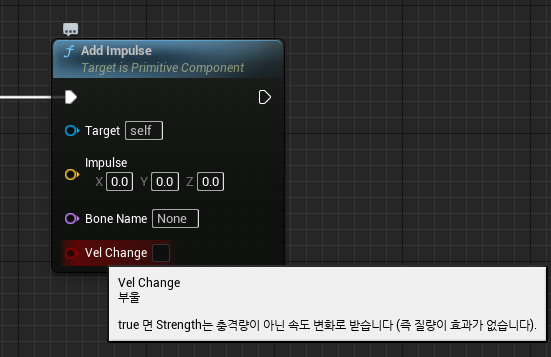
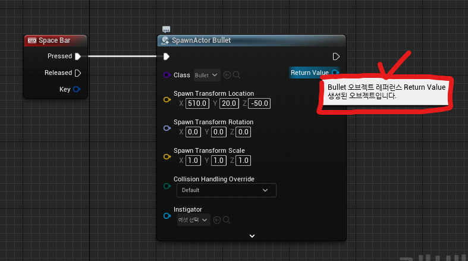
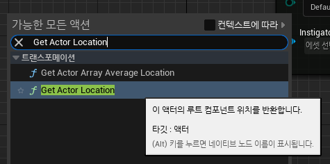
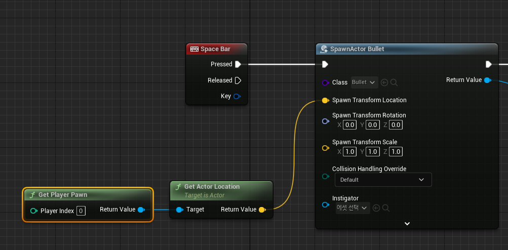

# :raccoon:시작해요 언리얼엔진🌳

---

# [7. 임펄스 & 레퍼런스]
작성자 : 19 김성우

<pre>
오늘은 임펄스를 사용해서 생성되는 총알에 앞으로 발사되는 효과를 추가하고 플레이어를 기준으로 발사되도록 해보겠습니다.
저번주에 진행하던 레벨 블루프린트 화면에서 이어집니다.
</pre>

---
  
## 1.임펄스
>>  
>   마우스 오른쪽을 눌러서 'Add Impulse' 노드를 추가합니다. 만약 검색해도 나오지 않는다면 오른쪽 위에 '컨텍스트에 따라'를 체크해줍니다.
> '컨텍스트에 따라'를 체크해놓게 되면 현재 컨텍스트에 적용 가능한 노드들만 보여주게 되고 체크를 해제하면 모든 노드들 중에서 보여줍니다.
>   'Add Impulse'를 사용하기 전에 어떤 핀들이 있는지 확인하고 넘어가겠습니다.
>>   
>   Target핀은 충격을 가할 오브젝트의 오브젝트 레퍼런스를 값으로 받습니다.(레퍼런스가 무엇인지에 대해서는 이따가 설명하도록 하겠습니다.)

>>   
>   Impulse핀은 오브젝트에 가할 충격량에 대한 벡터를 값으로 받습니다.

>>   
>   Vel Change핀은 오브젝트에 가할 충격량을 오브젝트의 질량에 관계없이 내가 원하는 충격량이 전해지도록 해줍니다.

>>   
>   우리가 만들고자 하는 총알은 위와같이 설정해줍니다.
>   실행을 해보면 이제 총알이 생성되면 앞으로 발사되는 모습을 보여줍니다.

## 2.레퍼런스
> 위에서 잠깐 등장했던 레퍼런스에 대해 설명을 하고 넘어가겠습니다.
>   레퍼런스는 우리가 4강에서 배웠던 오브젝트와 관련이 있습니다. 레퍼런스는 간단히 말하자면 오브젝트의 주소를 의미합니다. 특정 오브젝트를 직접 넘겨주는 것이 아니라 주소값만 넘겨줌으로서 특정 오브젝트에 대한 작업을 할 수 있도록 합니다.
>   유니티에서 자주 보이는 오류 중 하나인 'Null Reference' 오류를 보면 우리는 "아 내가 인스펙터 창에 오브젝트를 안 넣어줬구나"하고 넘어갔었는데 그 레퍼런스가 지금 말하는 레퍼런스와 동일합니다.
>   그리고 "오브젝트의 머테리얼이 필요한 상황"과 "오브젝트의 콜라이더가 필요한 상황" 둘 다 똑같이 인스펙터 창에 오브젝트 자체를 직접 끌어다넣어도 동작했던 이유는 그 오브젝트의 다른 부분이 필요한 경우라도 그 오브젝트의 레퍼런스를 알고있으면 나머지 부분은 찾아갈 수 있기 때문입니다.
>    다시 언리얼로 돌아와서 방금 만들었던 'Add Impulse'와 'Spawn Actor' 노드를 확인해보도록 합시다.
> 
>>   
>   Target핀은 충격을 가할 오브젝트의 오브젝트 레퍼런스를 값으로 받고 있습니다.

>>   
>   'Spawn Actor ~' 노드의 리턴 값을 보면 'Bullet 오브젝트의 오브젝트 레퍼런스'를 리턴 값으로 뱉고 있는 것을 확인할 수 있습니다.
>   따라서 'Spawn Actor'에서 나온 레퍼런스를 'Add Impulse'에 넘겨주면 결론적으로 'Spawn Actor'에서 생성한 오브젝트에 임펄스를 추가할 수 있게 됩니다.

## 3.총알 등장위치 수정(레퍼런스 활용)
> 레퍼런스에 대해 배웠으니 총알의 등장위치를 수정해보도록 하겠습니다.
>  지금은 우리 눈에 보이는 앞쪽의 적당한 위치에 총알을 생성하고 있지만 캐릭터 폰의 위치를 가져와서 캐릭터 폰에서 발사되도록 수정해봅시다.
>  아래에 수정방법을 적을거지만 방법을 보기전에 혼자서 한번 방법을 생각해본 뒤 답을 보도록 합시다.

>> 
>   먼저 'get player pawn' 노드를 추가합니다. 'get player pawn'노드는 플레이어 폰, 즉 플레이어가 조종하는 캐릭터의 레퍼런스를 반환해줍니다.
>   이제 우리는 캐릭터 오브젝트를 찾아냈습니다. 하지만 우리가 원하는건 이 캐릭터 자체의 레퍼런스가 아닌 이 캐릭터의 'Location값(위치값)'이 필요한 상황입니다.

>>   
>   그리고 'Get Actor Location' 노드를 추가해줍니다. 이 노드는 특정 액터의 위치값 벡터를 반환해줍니다.

>>   
>   이제 우리가 원했던 캐릭터의 위치값을 얻었으니 'Spawn Actor ~'의 Location핀에 연결해 줍니다.

>    이제 플레이 버튼을 눌러 테스트해봅시다. 캐릭터를 좌우로 움직이면서 쏴보면 정상적으로 캐릭터의 위치를 기준으로 총알이 발사됨을 확인할 수 있습니다.
>   하지만 화면을 돌려서 다른 방향으로 쏘려고해봤지만 여전히 정면으로만 발사되는 문제가 있습니다. 이 문제는 다음 시간에 '전방 벡터'를 사용해서 해결해보도록 하겠습니다.

---
## 다음 시간에 할 내용
> 오늘은 임펄스를 사용해서 총알을 앞으로 발사하고 레퍼런스를 사용하여 캐릭터의 위치 벡터를 받아오고 캐릭터를 기준으로 발사되도록 만들어보았습니다.
> 다음 시간에는 '전방 벡터'를 사용하여 플레이어가 보고 있는 방향으로 총알이 발사되도록 해보겠습니다.

---
## 다음 시간에 할 내용
> 오늘은 임펄스를 사용해서 총알을 앞으로 발사하고 레퍼런스를 사용하여 캐릭터의 위치 벡터를 받아오고 캐릭터를 기준으로 발사되도록 만들어보았습니다.
> 다음 시간에는 '전방 벡터'를 사용하여 플레이어가 보고 있는 방향으로 총알이 발사되도록 해보겠습니다.

